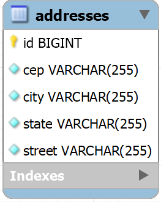

# Challenge 3 - Gerenciamento de Usuários: MSAddress (CompassUOL)
O projeto consiste no desenvolvimento de uma API REST para um sistema de gerenciamento de usuários, utilizando as tecnologias e conhecimentos aprendidos até o momento durante essa jornada do programa de bolsas de estágio da Compass UOL | Back-end Journey (Spring Boot) - AWS Cloud Context.

O projeto foi organizado em formato de microsserviços, onde cada microsserviço é responsável por uma parte do sistema. Segue os microsserviços desenvolvidos e a funcionalidade de cada um:

| **Microsserviço** | **Funcionalidade**                                                                                                                                                                                                  |
|-------------------|---------------------------------------------------------------------------------------------------------------------------------------------------------------------------------------------------------------------|
| [MSUser](https://github.com/quasemago/Compass_Challenge3_MSUser)            | É responsável por armazenar e gerenciar os dados dos usuários, sendo integrado ao MSAddress e MSNotification.                                                                                                       |
| [MSAddress](https://github.com/quasemago/Compass_Challenge3_MSAddress)         | Encapsula a API ViaCEP e fornece um endpoint para consulta de endereço, tanto por CEP quanto por Id. Caso esse CEP não exista na base dados, consome a API ViaCEP e persiste o endereço para consultas posteriores. |
| [MSNotification](https://github.com/quasemago/Compass_Challenge3_MSNotification)    | Recebe notificações de eventos por parte dos usuários (MSUser), sendo eventos de CREATE, UPDATE, UPDATE_PASSWORD e LOGIN. Armazena essas notificações de eventos em um banco de dados NoSQL MongoDB.                |

### Autor do Projeto
O projeto foi desenvolvido por **Bruno Patrick Formehl Ronning**.

| **E-mail**                           | **Usuário Github** |
|--------------------------------------|--------------------|
| bruno.ronning.pb@compasso.com.br     | quasemago          |

## Sumário

## Tecnologias Utilizadas
- Java JDK 17
- Spring Boot 3

### Dependências
- Spring Boot Test (inclui o JUni 5 e Mockito)
- Spring Web
- Spring Data JPA
- Spring Validation
- Spring DevTools
- Spring Doc OpenAPI (Swagger)
- Spring Cloud OpenFeign
- Lombok
- JJwt (Java JSON Web Token)
- Banco de dados H2 (utilizado apenas nos testes unitários)
- Banco de dados MySQL

---
# Microsserviço de Endereços (MSAddress)
O microsserviço de endereços é responsável por encapsular a API ViaCEP e fornecer um endpoint para consulta de endereço, tanto por CEP quanto por Id.
Caso esse CEP não exista na base dados, consome a API ViaCEP e persiste o endereço para consultas posteriores.

Dessa forma, não é necessário fazer uma requisição para API ViaCEP toda vez que um endereço for consultado, pois o endereço já estará persistido no banco de dados.
Nesses casos, o microsserviço de usuários (MSUser) pode fazer uma requisição para o MSAddress passando um identificador (Id) do endereço em vez de passar o CEP, visto que ele já estará atrelado a um usuário existente.

Ademais, como o MSAddress é um microsserviço independente, podemos ter uma maior liberdade para definir onde e como os dados de endereços serão armazenados, podendo até utilizar algum serviço externo como o RDS da Amazon AWS.

### Estrutura do banco de dados
O banco de dados utilizado para armazenar os endereços é o MySQL. A estrutura do banco de dados é composta por uma única tabela chamada `addresses` com os seguintes campos:



### Regras de Negócio
- Ao receber uma requisição para consultar um endereço por CEP, deve verificar se o endereço já está persistido no banco de dados, caso não esteja, consumir a API ViaCEP e persistir o endereço.

## Endpoints
A API Rest do MSAddress possui os seguintes endpoints:

| **Método** | **URL**            | **Descrição**                                                                                  |
|------------|--------------------|------------------------------------------------------------------------------------------------|
| `GET`      | /v1/address/:value | Recupera informações de um endereço, através do CEP ou Id. (Requer autenticação por Token JWT) |

É importante lembrar que o endpoint `/v1/address/:value` requer autenticação por Token JWT, que deve ser passado no _header_ da requisição.

## Payloads
A API Rest do MSAddress possui apenas um payload de resposta (Response), sendo:
- `AddressResponse`: Payload utilizado para responder às requisições de recuperação de endereço. Exemplo:
    ```json
    {
      "id": 1,
      "street": "Praça da Sé",
      "city": "São Paulo",
      "state": "SP",
      "cep": "01001-000"
    }
    ```

## Fluxo de erros
Para tratamento de exceções, a API possui um fluxo de erros padrão, que consiste em um payload de resposta chamado `ErrorMessage`, que possui as informações do código do erro, o _status_, e a mensagem.

Algumas situações tratadas pelo fluxo de erros são:

- Erro de validação:
    ```json
    {
      "code": 400,
      "status": "Bad Request",
      "message": "O valor informado não é um CEP válido (99999-000) ou um Id!"
    }
    ```

- Erro de autenticação:
    ```json
    {
      "code": 401,
      "status": "Unauthorized",
      "message": "Não foi possível processar a autenticação: Token JWT inválido ou expirado."
    }
    ```

# Como executar o projeto
O projeto foi desenvolvido utilizando a linguagem de programação Java, utilizando o Java Development Kit (JDK) na versão 17.
Portanto, para executar o projeto, é necessário ter o JDK 17 instalado na máquina, que pode ser baixado através do link: [Download Java JDK 17](https://www.oracle.com/java/technologies/downloads/#java17)

### Pré-configurações
Antes de executar o projeto, é necessário fazer algumas configurações, como, por exemplo, a configuração do banco de dados MySQL.
Para isso, basta acessar o arquivo ``application.yml`` localizado na pasta ``src/main/resources`` e alterar as seguintes propriedades de acordo com suas preferências.

Porém, é recomendado utilizar variáveis de ambiente para configuração do projeto, evitando assim que informações sensíveis fiquem expostas no código-fonte, além de não ser necessário recompilar o projeto toda vez que for necessário alterar alguma configuração.
Caso você não configure as variáveis de ambiente, o projeto utilizará as configurações padrões.

**Segue a lista de propriedades que podem ser configuradas via variáveis de ambiente:**

| **Nome da variável**  | **Descrição**                                | **Valor Padrão**                                                                                  |
|-----------------------|----------------------------------------------|---------------------------------------------------------------------------------------------------|
| TOMCAT_PORT           | Porta para subir o servidor WEB Tomcat       | 8081                                                                                              |
| MYSQL_URL_HOST        | URL de conexão do banco MySQL                | jdbc:mysql://localhost:3306/compasschallenge3_msaddress?useSSL=false&allowPublicKeyRetrieval=true |
| MYSQL_USERNAME        | Usuário para conexão MySQL                   | root                                                                                              |
| MYSQL_PASSWORD        | Senha do usuário para conexão MySQL          | 123456                                                                                            |
| CHALLENGE3_JWT_SECRET | Chave secreta para autenticação do Token JWT | 909266500255685261705041354583000                                                                 |

## Executando o projeto (Terminal)
Para executar o projeto diretamente via terminal, além do JDK 17, é necessário ter o _apache maven_ instalado na máquina, que pode ser baixado através do link: [Download Apache Maven](https://maven.apache.org/download.cgi)

Após tudo instalado, basta abrir o terminal na pasta raiz do projeto, e executar o comando ``mvn clean install`` para que todas as dependências sejam baixadas. Após isso execute o comando ``mvn clean package`` para compilar nosso projeto.

Após a execução dos comandos acima, observe que será criado uma pasta chamada ``target`` na raiz do projeto, essa pasta contem o nosso projeto compilado, sendo nomeado de ``msaddress-1.0.jar``. Após entrar na pasta, basta executar o arquivo compilado do projeto utilizando o java.

Para executar o projeto, basta executar o comando ``java -jar msaddress-1.0.jar``.

### Projeto em execução
Com o projeto já em execução, basta acessar o endereço ``/docs-msaddress.html`` para acessar a documentação da API por meio do Swagger.
Por exemplo, se estiver executando o projeto localmente com as configurações padrões, o endereço será ``http://localhost:8081/docs-msaddress.html``.

### Arquivo Swagger
Para facilitar o uso da API, foi gerado um arquivo em JSON do Swagger da API, que pode ser baixado através do link [Download Swagger File](CompassUOL%20Challenge%203%20-%20MSAddress%20Bruno%20Patrick_Swagger.json), você pode importar esse arquivo no [Swagger Editor](https://editor.swagger.io/) para visualizar a documentação da API.

---
# Considerações Finais
O terceiro desafio (Challenge 3) do programa de bolsas de estágio da Compass UOL | Back-end Journey (Spring Boot) - AWS Cloud Context, representou uma grande oportunidade de aprendizado para aplicar os conhecimentos adquiridos até o momento no programa.

Ao utilizar tecnologias como Spring Boot, Swagger e JUnit e Mockito, foi possível criar uma API robusta, testada e bem documentada, seguindo boas práticas de desenvolvimento, garantindo assim a qualidade do projeto, além de facilitar o uso da API por parte de outros desenvolvedores.

Portanto, é importante destacar que esse desafio foi de grande importância, pois além de implementar uma API REST, que havia sido o foco do desafio anterior, foi necessário implementar uma integração entre microsserviços, utilizando de serviços de mensageria como o RabbitMQ e serviços de requisição HTTP como o OpenFeign.

Agradeço à Compass UOL pela oportunidade de participar do programa de bolsas de estágio, e por proporcionar desafios que contribuem para o meu crescimento profissional.

Atenciosamente, [Bruno Patrick Formehl Ronning](#autor-do-projeto).
